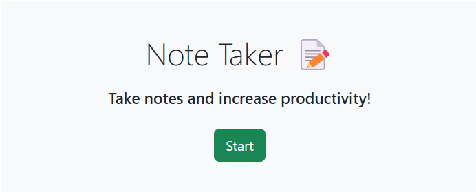
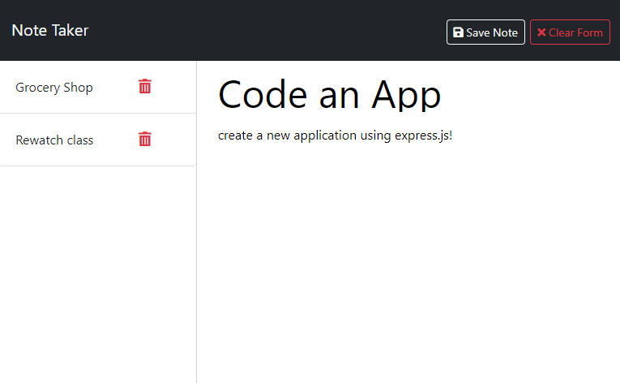
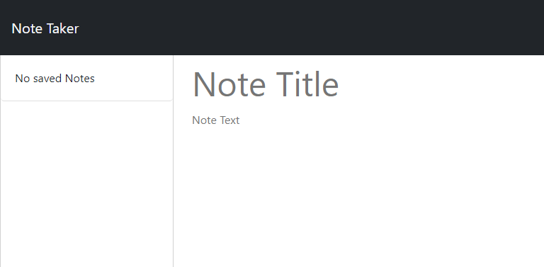

# Note Taker

## License

This project is licensed under the [MIT License] - see [LICENSE](LICENSE) file for more details.

## Description

A note taking application that can write and store notes to help the user improve productivity and avoid forgetfulness.  

## Table of Contents

- [License](#license)
- [Description](#description)
- [Screenshots](#screenshots)
- [Installation](#installation)
- [Usage](#usage)
- [Technologies](#technologies)
- [Questions](#questions)

## Screenshots
### App Landing Page

### Notes Written and Saved

### Notes Deleted

## Installation
No installation necessary.  Simply visit the application's deployed like here: 

## Usage

### Run application:

1. Run the application by visiting the deployed link.
2. User will be greeted with a landing page briefly describing the apps functionality.  User click "Start".
3. In following fields users can write and save notes by writing in the "Note Title" and "Note Text" fields, then pressing "save".
4. To delete notes, simply click on the red trash icon next to your saved notes. 

## Technologies

### Express.js 

## Questions

[Follow me on Github!](https://github.com/Dossman-thomas)

Have any further questions? Feel free to reach me via tdossman.development@gmail.com
